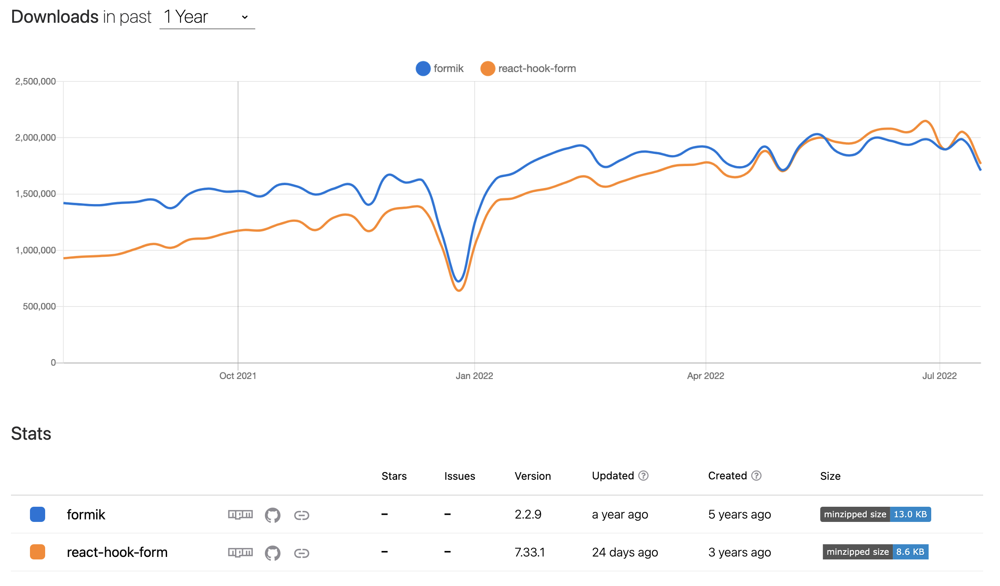

# React Form Handling Practice

- 리액트 form 핸들링 연습 레포지토리

> 🖥 [DEMO](https://react-form-handling-practice.netlify.app/) - netlify deploy

 

## React Form Library?

라이브러리 없이 리액트에서 form 을 다루는 것은 **validation, form fields, error** 등 고려할 부분이 많기 때문에 보다 편한 개발을 위해 라이브러리를 사용

 

## Formik vs React Hook Form

리액트에서 가장 많이 사용하는 **Form Validation library** 는 `Formik`와 `React Hook Form` 가 있다.

> npm trends 비교 (2022.07.25 기준)

 

### Formik

- 가장 많이 사용되는 라이브러리 이며 사용하기 쉽다.
- provider 방식으로, form내에 있는 모든 컴포넌트들이 동일한 상태를 공유한다.
- 특정 state만 watch할 수 없고 전체를 업데이트 하며, **불필요한 re-rendering 많이 발생**한다.
- 따라서 복잡한 form을 다루기 힘든 단점이 있다.
- 유효성 체크를 위해, `yup`라이브러리 와 함께 많이 사용한다.

 

### React Hook Form

- Formik 다음으로 많이 사용되는 라이브러리이며 똑같이 사용하기 쉽다.
- 타입스크립트로 작성된 라이브러리 즉, 타입스크립트 기본 제공한다.
- 불필요한 re-rendering을 피하기 위해 `uncontrolled components`를 사용하도록 설계, 따라서 re-rendering 최소화

 

### Formik vs React Hook Form 정리

| &nbsp;   | Formik                                                 | React Hook Form                            |
| -------- | ------------------------------------------------------ | ------------------------------------------ |
| 방식     | provider                                               | uncontrolled components                    |
| 리랜더링 | input에 입력하면서 지역 상태가 변할떄마다 re-rendering | 최소한의 re-rendering                      |
| 크기     | 중간 (약 15KB)                                         | 작음 (약 9KB)                              |
| 커뮤니티 | 큰 수준의 커뮤니티, 잘 정립된 폼 라이브러리            | 중간 수준의 커뮤니티, 성장 중인 라이브러리 |

 

## Formik 사용법

Formik 사용법 정리 중..

 

## React Hook Form 사용법

React Hook Form 사용법 정리 중..
